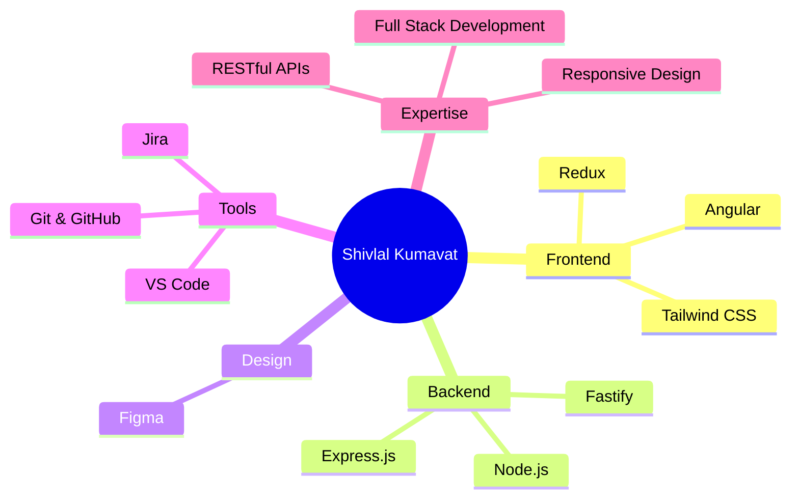

# 👋 Hi, I'm Shivlal Kumavat

<div align="center">
  
  
  
  [](https://in.linkedin.com/in/shivlal-kumavat)
  [](https://github.com/slk5611)

</div>

---

## 🚀 About Me

```javascript
const shivlal = {
  location: "Surat, India",
  role: "Senior Full Stack Developer",
  specialization: "Node.js, Angular, AWS & Microservices",
  passion: "Creating meaningful digital experiences that solve real problems",
  currentFocus: "Scalable architectures & high-performance APIs",
  workStyle: "Clean code, constant learning, real impact",
  motto: "From idea to production 🚀",
};
```

I’m a **Senior Full-Stack Developer with a strong focus on Node.js**, and I’ve spent years building end-to-end web applications using the **MEAN stack**. I genuinely enjoy solving real-world problems, learning along the way, and turning ideas into products people can actually rely on. Whether I’m shaping a clean, intuitive front end or building a scalable and stable backend, I care about writing good code and delivering solutions that truly work.

---

## 💼 What I'm Up To

- 💻 **Currently working as a Full-Stack Developer** - Mainly focused on Node.js and modern web technologies
- 🤝 **Open to opportunities** — Interested in meaningful projects, collaborations, and problem-solving roles
- 🌍 **Open-source contributor** — Enjoy contributing to projects that create real value
- 🧠 **Driven by curiosity** — I code because I enjoy learning and building, not just because it’s my job
- 🎯 **Goal** — Building reliable, user-focused products that make a real difference

---

## 🛠️ Tech Stack

### **Backend Development**

<p align="left">
  
  
  
</p>

### **Databases & Storage**

<p align="left">
  
  
  
   
   
</p>

### **Tools & Technologies**

<p align="left">
  
  
  
   
  
   
</p>

### **Frontend Development**

<p align="left">
  
  
  
   
  
  
  
  
  
</p>

<div align="center">
  
  ### 📊 **Project Stats**
  
  | 🎯 Category | 📈 Count | 💡 Highlights |
  |------------|---------|--------------|
  | **MEAN Stack** | 10+ projects | Full-stack web applications |
  | **Angular Apps** | 10+ projects | SPA & interactive UIs |
  | **NodeJs** | 20+ projects | RESTful APIs, Batch & Async Processing, JWT & OAuth |
  | **Cloud & DevOps** | 15+ projects | AWS (Lambda, API Gateway, S3, SQS, SNS), Docker, CI/CD pipelines, Redis |
  
</div>

---

## 🎯 Skills & Expertise



---

<div align="center">
  
  ### 🌐 **Get in Touch**
  
  <p>
    <a href="https://wa.me/+918264254015">
      
    </a>
    <a href="https://itjugadu.com">
      
    </a>
    <a href="https://github.com/slk5611">
      
    </a>
  </p>
  
  <p>
    <a href="https://www.linkedin.com/in/shivlal-kumavat">
      
    </a>
    <a href="https://twitter.com/slk5611">
      
    </a>
    <a href="mailto:slk.kumavat@gmail.com">
      
    </a>
  </p>
  
</div>

<br>

<div align="center">
  
  ### ⚡ **Quick Response Time**
  
  | 📱 Platform | ⏱️ Response Time | 🎯 Best For |
  |------------|-----------------|-----------|
  | **WhatsApp** | Within 1 hour | Urgent queries & quick chats |
  | **LinkedIn** | Within 8 hours | Business proposals & detailed discussions |
  | **GitHub** | Within 24 hours | Code reviews & project collaborations |
  
  <br>
  
  
  
</div>

<br>

<div align="center">
  
  ### 🎯 **What I'm Looking For**
  
  ```javascript
  const lookingFor = {
    projects: ["Scalable backend services and APIs", "Async processing and batch systems"],
    collaboration: ["MEAN stack projects", "NodeJs development"],
    interests: ["AI integration", "Performance optimization", "Scalable backend systems"]
  };
  ```
  
</div>

---

## 🌟 Fun Facts

- 🔥 I enjoy building things with code and improving them over time
- ☕ Late nights, clean code, and problem-solving
- 🧠 Curious by nature — always exploring new ideas, tools, and approaches
- 📚 Lifelong learner — I like staying sharp and up-to-date
- 💭 <I>Good code is simple, thoughtful, and built to last.</I>

---

<div align="center">
  
  ### 💖 Thank you for visiting my profile!
  
  **⭐ From [Shivlal Kumavat](https://github.com/slk5611) with ❤️**
  


</div>
